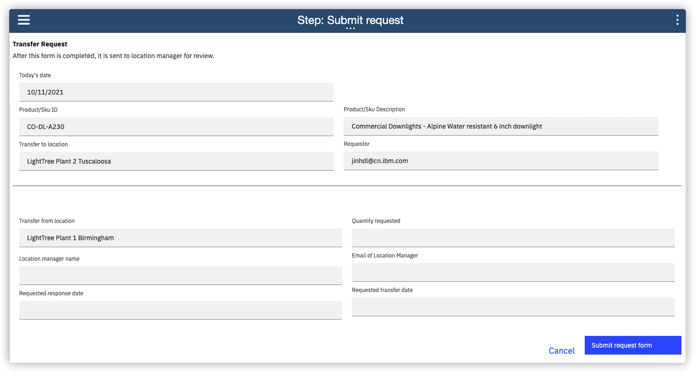
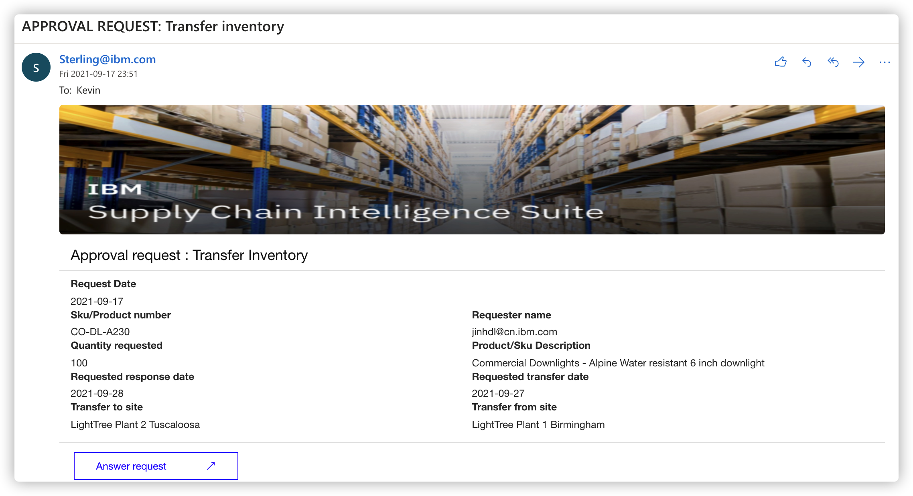
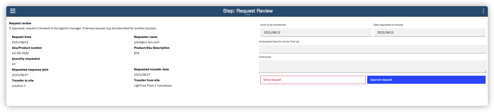

# Transfer inventory workflow tutorial

This tutorial walks you through the steps of the Transfer Inventory workflow. In this tutorial, we assume that you have successfully imported and configured the **Transfer Inventory** sample in your environment. Once you have opened the **Transfer Inventory** process within the [Process Designer](https://www.ibm.com/docs/en/baw/20.x?topic=applications-process-designer), you should see the following process definition diagram. This process is composed of a set of system and human tasks between a requestor, who requests an inventory transfer from an alternate location, and a manager, who must approve or deny the transfer request for their respective location.

## Starting the process

Start an instance of the process using the [web Inspector tool](https://www.ibm.com/docs/en/baw/20.x?topic=applications-running-debugging-processes-in-web-inspector) found in the Process Designer. Note that the **Transfer Inventory** sample requires a single `workItem` input variable to be defined when it starts. Once the process is started, you will enter into the first task of the process which is named **Create or update work item**. This task is a system task that runs immediately. It is responsible for either creating a work item definition in Sterling InfoHub system or else updating an existing work item definition with the assignment of the initiator of the process. This is a necessary step to ensure that the state and ownership of the current work item is accurately reflected. This task is implemented as a service flow which utilizes our sample toolkit to communicate with Sterling InfoHub using its work item APIs.

## Requesting an inventory transfer

Once the system task completes, the process enters the first user task which is named **Submit request**. This task is meant to produce a transfer request form which is to be filled out by the requestor who initiated the **Transfer Inventory** workflow. When this task runs, it immediately begins to pre-populate certain form fields based on the inventory object associated with the current work item. It accomplishes this by against communicating with **Sterling Infohub** system through the sample toolkit. It uses the graph APIs exposed by **Sterling Infohub** to query the relevant inventory information needed to pre-populate the form. Once the inventory information is gathered, the following form should be produced for this user task. It is expected that the requestor complete the remainder of the form according to their business needs, specifying the relevant quantities, transfer dates, and associate managers. 

Once the form is submitted, the process begins to execute two tasks in parallel, the first of which is to send an external email to the location manager who responsible for approving the form (this is the same manager specified on the request form itself). This task is named  **Send request notice email** and it is also implemented as a service flow using our sample toolkit to send an email to designated recipient. This email serves as on external notification to the manager and contains a link into the [IBM Business Automation Process Portal](https://www.ibm.com/docs/en/baw/20.x?topic=overview-process-portal) where the manager may complete their approval task. The content of email body is shown below.

## Reviewing an inventory transfer

Once the transfer request is submitted, the process navigates to the approver of the transfer request, who must approve or deny the incoming transfer request. The process enters into the user task which is called **Review request**. This task produces a form which contains the additional request in read-only format, as well as additional fields to signify whether or not the request is accepted or denied  by the approver. It is expected that the approver complete the form by selecting their decision and providing any additional comments.

## Viewing the approval status

Since business processes involve potentially long running and asynchronous operations (it may take the approver some time before making their decision), it is important to surface the latest status of the request to the initial requestor. The **Transfer Inventory** sample provides a **View Request** activity which allows the requestor to review their request and to view whether or not the request was approved or denied by the respective location manager. 

## Ending the process

Once the location manager approves or denies the incoming request, the process navigates to its final system task which is called **update work item**. This is a system task akin to **create or update work item**. It uses the sample toolkit to update the status of the work item, moving it from in-progress state to a pending state. Note that this task is executed whether or not the manager approves or rejects the current form. 